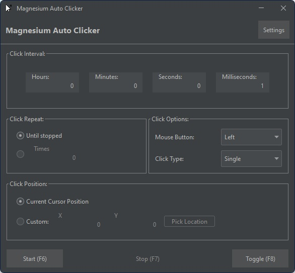
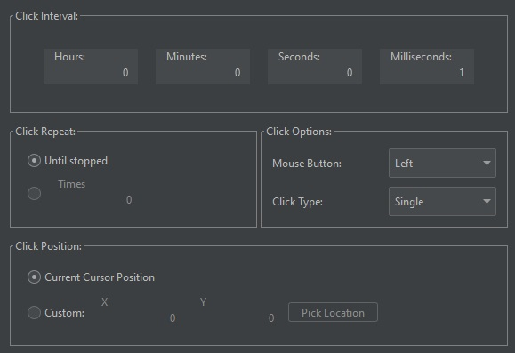
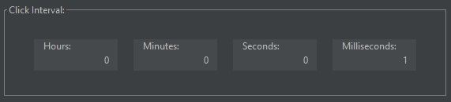
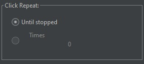
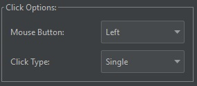
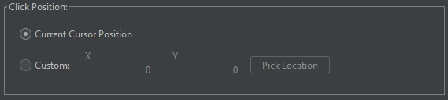
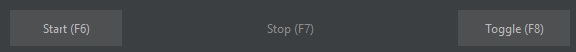
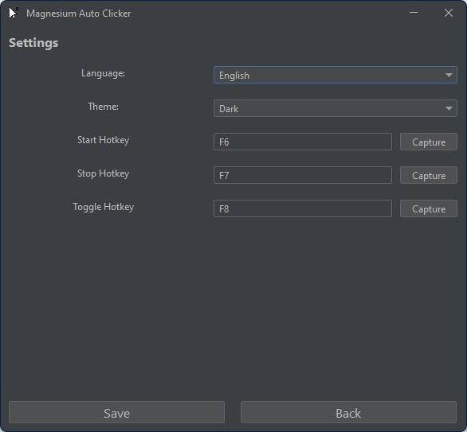

# Magnesium Auto Clicker
## Description:
Easy application for *"auto-clicking"*.
You can set the interval, mouse button, click type and click position in the application. 
In addition, you can start/stop/toggle Auto-Clicker by simply using a shortcut (which can also be customized).
Design is highly inspired: [GT Auto Clicker](https://apps.microsoft.com/detail/9ndjq0j8ksdz?ocid=webpdpshare).

## System requirements:
Operating System: Windows
Java: 12+ 
And anything else not mentioned from there: [JNativeHook](https://github.com/kwhat/jnativehook/blob/2.2/README.md).

## Installation:
### Windows:
---
#### Portable:
Simply unpack zip archive and run .exe file.

#### Traditional:
Run `MagnesiumAutoClicker_installer.exe` and follow wizard instructions.

## Known issues:
There are no known issues at the moment.

## Bug reporting:
Any problems should be reported here on GitHub in [Issue tab](https://github.com/maksik997/MagnesiumAutoClicker/issues/1).

## Functions:
1. Main Panel:
   Main Panel features with a couple of buttons and text fields.
   All of them are organized with smaller panels.
   In the upper part of the screen you can see header panel, which contains title and settings button (which leads to settings panel). 
    
   Next, in the middle you can see four different small panels (Click interval, Click repeat, Click options and Click position). 
    
   Click interval panel let you adjust interval between different clicks. 
    
   Click repeat panel let you set how many times you want to click, or maybe you want to click until stopped. 
    
   Click options panel let you set which mouse button you want to use (Left/Middle/Right), a what type of click you want to use (Single/Double). 
    
   Click position panel let you set position for your clicks, you can set location yourself, by simply editing x and y text field, or you can use pick location button, 
   or you can simply click wherever you like by simply setting to snap to current cursor position. 
    
   After that in the bottom part of a window you can see three buttons: Start, Stop and Toggle.
   Each of these buttons have different function, so lets briefly describe them. 
    
   Start button let you start the auto clicking feature, with selected settings (you can use this button by using shortcut, by default F6). 
   Stop button let you stop the auto clicking feature, if auto clicking is enabled (you can use this button by using shortcut, by default F7). 
   Toggle button combines both Start and Stop button, and depending on the current state of auto clicking feature can turn it to on or off
   (you can use this button by using shortcut, by default F8). 
2. Settings panel:
   Settings panel features with a couple of adjustable combo boxes, text fields and button. 
   footer_panel
   Firstly, as you can see you have simple language and theme selector, to adjust them just simply pick the desired option. 
   Next, we have free entries (start/stop/toggle) hotkey, they allow you to set the desired shortcut for those buttons in the main panel.
   To adjust them simple click `Capture` button, and you will see red border around text field at this very moment just simple press desired button
   **(Important: only few buttons can be set as shortcuts, described later)** 
   And at the end, we have two buttons Save and Back, Save button must be clicked anytime you've changed something and want to save it and Back button simply takes you to main panel.
   **(Important: If you leave settings panel using Back button without saving, any change you've made will be forgotten forever)** 
    
3. Shortcut buttons:
   List of available shortcut button:
   - F1
   - F2
   - F3
   - F4
   - F5
   - F6
   - F7
   - F8
   - F9
   - F10
   - F11
   - F12
   - Caps Lock
   - Ctrl
   - Alt
   - Shift
   - Escape
   - Backspace
   - Delete
   - Context Menu

## Used External Libraries:
- JNativeHook: [Link](https://github.com/kwhat/jnativehook/tree/2.2)
- FlatLaf: [Link](https://github.com/JFormDesigner/FlatLaf)

## Security information:
For anyone worried...
Yes application uses JNativeHook, which allows listening to keyboard and mouse without a focus,
but in the case of this application,
it is only used to allow comfortably executing shortcuts for three buttons in the main panel.
And that is the only reason. 
In any case, this application is open-sourced, so if you want, you can check yourself if it is safe to use.
